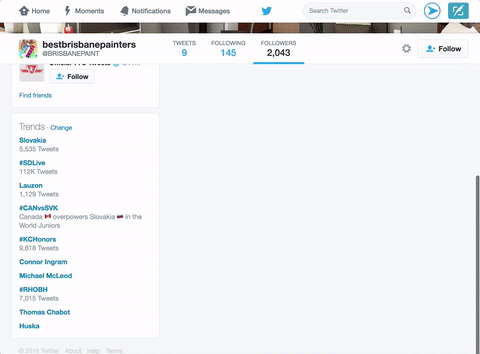

# Twitter Block
A chrome extension that blocks fake twitter followers

## How does it work?

Twitter Block is using a script built by [Clayton Lambert](https://claytonn.com/). When the script is called, it looks for every follower's picture, banner, description and link. Every follower gets a score according to those criterias. If the score is above a certain threshold, the follower will be blocked. This script was packaged into a chrome extension for ease of use.

## Which types of accounts will it block?

Here are the criterias to determine if an account is fake. A combination of those criterias will flag an account as fake.

- Accounts with an egg avatar,
- Accounts with a description length below 15 characters
- Accounts without a profile banner
- Accounts with a russian link

## How to install the extension

[hunter.io](https://hunter.io) wrote [a great blog post](https://blog.hunter.io/install-chrome-extension-manually/) on how to sideload extensions. The same steps apply to this extension.

## Built by

- [Clayton Lambert](https://claytonn.com/) (@claytonn) - Script
- [Justin Leger] (https://justinleger.ca) (@jusleg) - Chrome extension

## License

Copyright [2016] Clayton Lambert & Justin Leger

Licensed under the Apache License, Version 2.0 (the "License");
you may not use this file except in compliance with the License.
You may obtain a copy of the License at

    http://www.apache.org/licenses/LICENSE-2.0

Unless required by applicable law or agreed to in writing, software
distributed under the License is distributed on an "AS IS" BASIS,
WITHOUT WARRANTIES OR CONDITIONS OF ANY KIND, either express or implied.
See the License for the specific language governing permissions and
limitations under the License.
